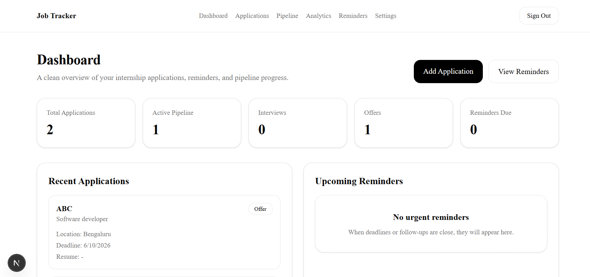
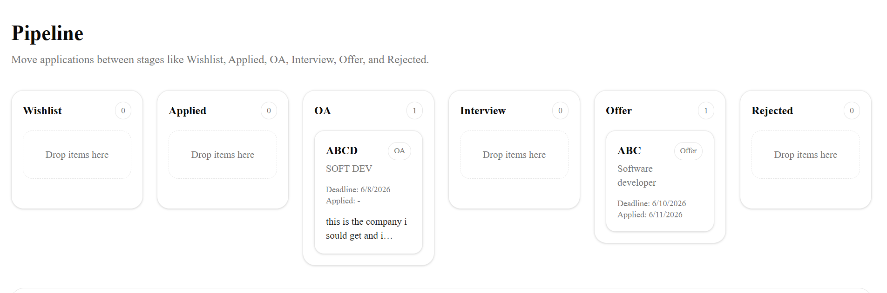
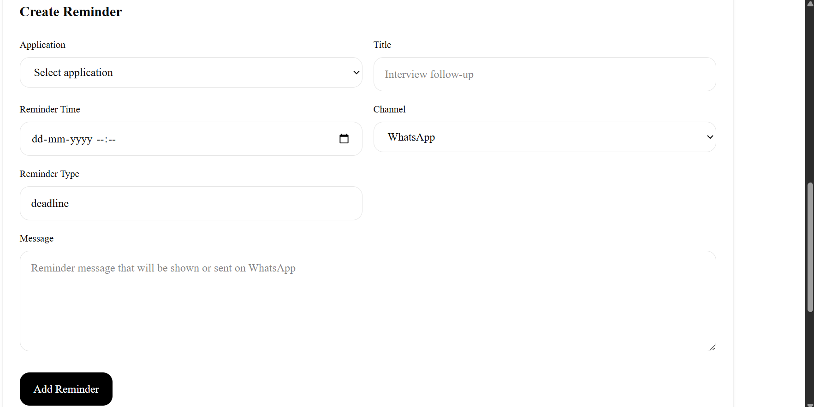
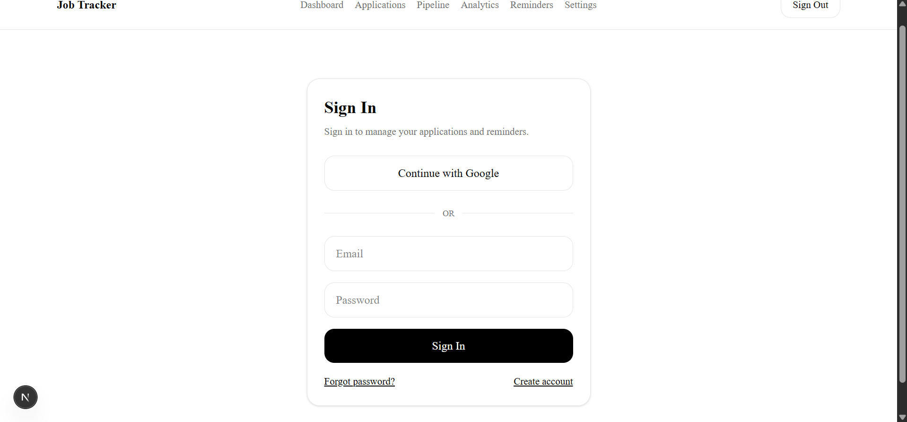
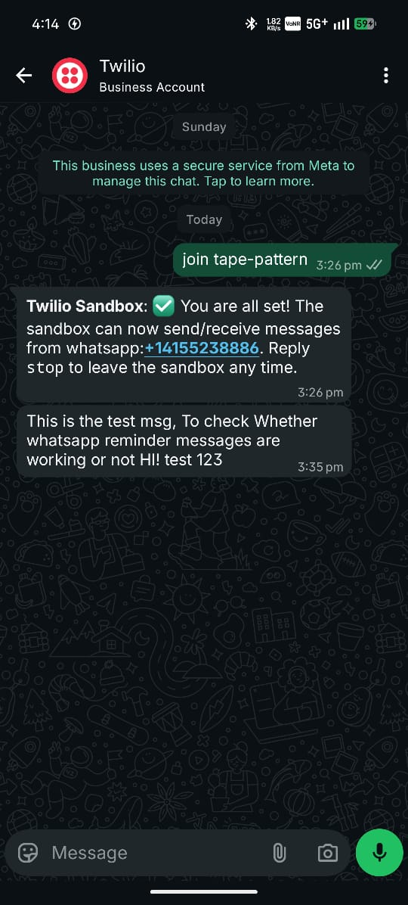

# Job Tracker

A full-stack internship and job application tracking platform built with Next.js, Supabase, TypeScript, Tailwind CSS, and Twilio WhatsApp integration.

The application helps students manage internship and job applications, track interview rounds, organize reminders, monitor application progress through a pipeline board, and analyze their application journey through dashboards and analytics.

---

# Features

## Authentication

* Email & Password Sign Up / Sign In
* Google Sign In
* Forgot Password
* Reset Password
* Secure session management using Supabase SSR Authentication

---

## Application Management

* Create, Edit and Delete Applications
* Store company details, role information, deadlines, job links and notes
* Search and filter applications
* Track preparation status

---

## Pipeline Tracking

* Visual application pipeline
* Move applications across stages
* Track progress from application to offer

Stages include:

* Wishlist
* Applied
* Online Assessment
* Interview
* Offer
* Rejected

---

## Interview Management

* Add interview rounds
* Store interview notes
* Track outcomes
* Save preparation notes
* Maintain interview history

---

## Reminder System

* Create custom reminders
* Deadline reminders
* Follow-up reminders
* WhatsApp reminder support using Twilio
* Automated reminder processing through cron jobs

---

## Analytics Dashboard

* Total applications
* Interview count
* Offer count
* Rejection count
* Pipeline distribution
* Application statistics

---

## Settings

* Profile management
* Skills tracking
* Target role preferences
* Notification preferences
* WhatsApp number configuration

---

# Tech Stack

## Frontend

* Next.js 16
* React
* TypeScript
* Tailwind CSS

## Backend

* Supabase
* PostgreSQL

## Authentication

* Supabase Auth
* Google OAuth

## Notifications

* Twilio WhatsApp Sandbox

## Charts & Visualization

* Recharts

## Deployment

* Vercel


## Dashboard



## Pipeline



## Reminders



## sign-in



## Test message 

---

# Database Schema

Main Tables:

* profiles
* applications
* interviews
* reminders
* tags

---

# Environment Variables

Create a file:

```text
.env.local
```

Add:

```env
NEXT_PUBLIC_SUPABASE_URL=

NEXT_PUBLIC_SUPABASE_ANON_KEY=

SUPABASE_SERVICE_ROLE_KEY=

TWILIO_ACCOUNT_SID=

TWILIO_AUTH_TOKEN=

TWILIO_WHATSAPP_NUMBER=

CRON_SECRET=
```

---

# Local Installation

## 1. Clone Repository

```bash
git clone <repository-url>
```

Example:

```bash
git clone https://github.com/yourusername/job-tracker.git
```

---

## 2. Enter Project Directory

```bash
cd job-tracker
```

---

## 3. Install Dependencies

```bash
npm install
```

---

## 4. Configure Environment Variables

Create:

```text
.env.local
```

and add all required values.

---

## 5. Configure Supabase

Create a Supabase project.

Run the SQL schema.

Enable:

* Email Authentication
* Google Authentication

---

## 6. Configure Twilio Sandbox

Join Twilio WhatsApp Sandbox:

```text
join <sandbox-code>
```

using your WhatsApp account.

---

## 7. Run Development Server

```bash
npm run dev
```

Open:

```text
http://localhost:3000
```

---

# Production Build

Build project:

```bash
npm run build
```

Start production server:

```bash
npm start
```

---

# Testing Flow

Recommended testing sequence:

1. Sign Up
2. Sign In
3. Add Application
4. Add Interview Round
5. Create Reminder
6. Process Reminder
7. Check Analytics
8. Update Settings
9. Test Google Login
10. Test Sign Out

---

# Future Improvements

* Email notifications
* Resume upload support
* Resume ATS scoring
* AI-based interview preparation
* Multi-user collaboration
* Calendar integration

---

# Author

Ravichandra S Bhure

